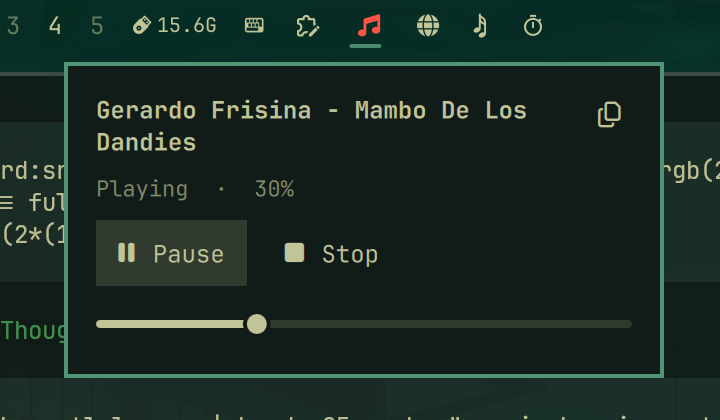

# SomaFM Bar

Bar widget for [Omarchy](https://omarchy.org/) that plays a SomaFM station through `mpv`, with a popup card for playback control.



## What it does

- A note icon in the bar, lit while the station is playing.
- Left-click opens the popup card under the icon — nothing starts playing until you press **Play**.
- Popup card: current track title, Play/Pause, Stop, a volume slider, and the list of audio outputs.
- Copy button next to the title puts the current track title on the clipboard and closes the card.
- Right-click the bar icon stops playback, middle-click toggles play/pause, scroll wheel changes volume in 5% steps.
- The popup closes on outside click or `Esc`.
- Volume and audio output are remembered between sessions.

Every PipeWire sink shows up in the **Output** list of the card, so the stream can go to the built-in speakers, headphones or a network device such as an AirPlay speaker (Sonos, HomePod, Apple TV). Selecting a row switches playback immediately while the stream keeps playing.

## Requirements

External commands used by the plugin (all in the Arch `extra`/`multilib` repositories):

| Command | Package | Used for |
| --- | --- | --- |
| `mpv` | `mpv` | audio playback and ICY track metadata |
| `jq` | `jq` | JSON parsing for config and IPC payloads |
| `socat` | `socat` | talking to the `mpv` IPC socket |
| `wl-copy` | `wl-clipboard` | the copy-title button |
| `pactl` | `pipewire-pulse` (or `pipewire-utils`) | listing audio outputs |

Omarchy itself already provides `mpv` and PipeWire on most installations. `mpv` is started with `--audio-display=no`, so the stream never produces a video window.

## Install

```bash
omarchy plugin add https://github.com/ltillegal/somafm-bar.git --enable
```

Or by hand:

```bash
git clone https://github.com/ltillegal/somafm-bar.git ~/.config/omarchy/plugins/io.github.ltillegal.somafm-bar
omarchy-shell shell rescanPlugins
omarchy plugin enable io.github.ltillegal.somafm-bar
```

The plugin id must match the directory name (`io.github.ltillegal.somafm-bar`), which is what `omarchy plugin add` does for you.

## Uninstall

```bash
omarchy plugin remove io.github.ltillegal.somafm-bar
```

If you added the keyboard shortcut below, remove it from `~/.config/hypr/bindings.lua` and run `hyprctl reload`.

## Configuration

Edit `config.json` in the plugin folder and then use **Stop** and **Play** (or restart the shell):

```json
{
  "station": "SomaFM Bossa Nova",
  "url": "http://ice6.somafm.com/bossa-128-mp3"
}
```

- `station` — the name shown in the widget tooltip when nothing is playing.
- `url` — a direct SomaFM stream URL. Channel names map to `https://ice2.somafm.com/<channel>-128-mp3`, for example `groovesalad`, `dronezone`, `indiepop`, `secretagent`, `defcon`, `thetrip`, `sonicuniverse`, `u80s`, `fluid`, `beatblender`, `cliqhop`, `dubstep`, `space-station-soma`, `metal`, `covers`, `folkfwd`, `left coast 70s`, `piano bar`, `voodooclub`.

Playback volume and audio output live outside the repository and are stored per user:

- `$XDG_RUNTIME_DIR/somafm-bar/` — mpv IPC socket, player pid, `status.json`, `mpv.log`
- `$XDG_DATA_HOME/somafm-bar/state.json` — remembered volume and output

### Audio output

The **Output** list in the popup card picks the PipeWire sink. The same switch works headlessly with the `player` script in this folder:

```bash
./player outputs     # id + label of every PipeWire sink
./player output <id> # switch, e.g. ./player output raop_sink.Mac-Ludens.local.192.168.0.111.7000
./player output      # go back to the system default
```

Network sinks such as AirPlay speakers show up once `pipewire-zeroconf` and the `raop-discover` module are configured — see the
[omacom/omarchy AirPlay guide](https://github.com/omacom/omarchy/discussions/3943).


## Stations & Favorites

The popup card now includes a searchable station list with favorites:

- **Favorites** — scrollable list of your saved stations. Click a favorite to switch instantly. Click the star to remove it.
- **All Stations / Search results** — scrollable list pulled live from SomaFM (cached for 1 hour). Type in "Search stations..." to filter by name/description. Click the star to add/remove from favorites.
- Stations are switched directly from the popup (the card stays responsive while switching).

Manage favorites headlessly with the player script:

```bash
./player stations     # list all SomaFM stations (JSON)
./player fav-list     # list favorites (JSON)
./player fav-add "Station Name" "http://..."  # add favorite
./player fav-remove "http://..."              # remove by URL
./player switch "Station Name" "http://..."   # switch station
```

## Keyboard shortcut

Optional. The widget ships an IPC target, so any toggle works. Add to `~/.config/hypr/bindings.lua` and run `hyprctl reload`:

```lua
o.bind("SUPER + SHIFT + R", "SomaFM", "omarchy-shell shell toggle io.github.ltillegal.somafm-bar")
```

The widget is driven by the shell's generic plugin targets:

```bash
omarchy-shell shell toggle io.github.ltillegal.somafm-bar   # open or close the card
omarchy-shell shell summon io.github.ltillegal.somafm-bar   # open
omarchy-shell shell hide io.github.ltillegal.somafm-bar     # close
```

## Privacy

The plugin talks to exactly one host: the stream URL from `config.json` (SomaFM). It writes no telemetry, reads no files outside the plugin folder and the two directories above, and touches the clipboard only when you click the copy button.

## License

MIT — see [LICENSE](LICENSE).